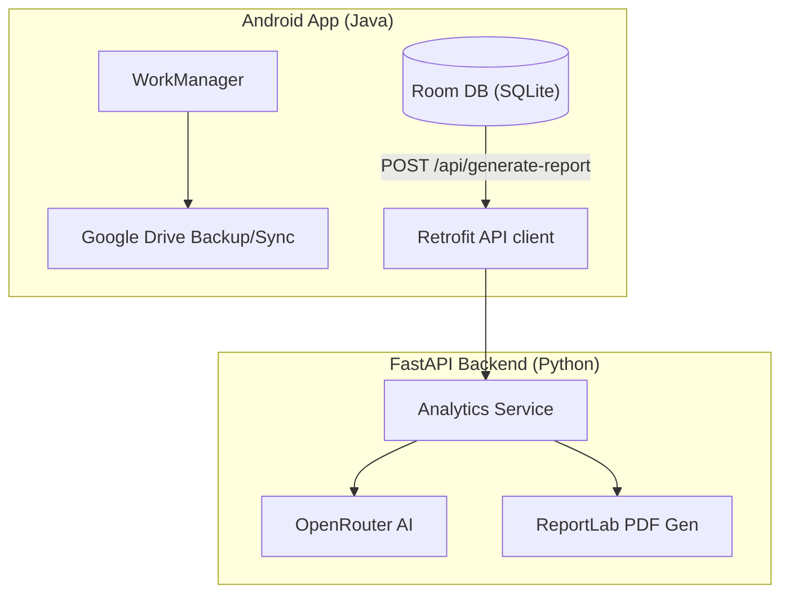

# ICTAZ MU Chapter Financial Tracker

> **Purpose:** Educational project & personal tool for managing chapter finances as Treasurer of the ICTAZ Mu Chapter (Information and Communications Technology Association of Zambia, Mulungushi University Chapter).

## Overview

A full-stack financial management system with an **Android client** (Java) and **Python/FastAPI backend** for AI-powered report generation. All transaction data lives on-device using Room (SQLite); the backend is only used for generating intelligent financial reports via OpenRouter AI.

## Developer Documentation

Full documentation lives in [`docs/`](./docs/):

| Document | Description |
|----------|-------------|
| [Architecture](./docs/ARCHITECTURE.md) | System diagrams, Android MVVM layering, backend request flow |
| [Data Model](./docs/DATA_MODEL.md) | Room schema (Chen ER notation), entities, DAO queries |
| [API Reference](./docs/API.md) | Backend endpoints, wire format, configuration |
| [Screens & Navigation](./docs/SCREENS.md) | Every screen, nav graph walkthrough, UI conventions |
| [Backup & Sync](./docs/BACKUP.md) | Google Drive backup, incremental diff/merge, auto-backup |
| [Security](./docs/SECURITY.md) | App lock, PIN storage (Keystore), session timeout |
| [Contributing](./docs/CONTRIBUTING.md) | Setup (uv for backend), conventions, and workflow for new developers |

## Architecture

Offline-first: the Android app owns all data in a local Room database. The stateless FastAPI backend only exists to generate AI-powered PDF reports.



Full diagrams and layer breakdowns: [Architecture](./docs/ARCHITECTURE.md) · [Data Model](./docs/DATA_MODEL.md) · [Backup & Sync](./docs/BACKUP.md) · [Security](./docs/SECURITY.md)

### Key Design Decisions

- **Offline-first** — All transactions stored locally on device. No server-side database.
- **Amounts in ngwee** — Monetary values stored as integers (100 ngwee = 1 ZMW) to avoid floating-point issues.
- **Backend is stateless** — Only computes analytics, calls AI, and generates PDFs. No auth, no database.
- **Incremental backup** — Detects changed transactions by `updatedAt` timestamps to minimize uploads.

## Tech Stack

### Backend
| Component | Technology |
|-----------|-----------|
| Language | Python 3.14 (managed with [uv](https://docs.astral.sh/uv/)) |
| Framework | FastAPI |
| Server | Uvicorn |
| PDF Generation | ReportLab |
| AI Integration | OpenRouter (default model: `qwen/qwen3-vl-30b-a3b-thinking`) |
| Validation | Pydantic / pydantic-settings |

### Frontend (Android)
| Component | Technology |
|-----------|-----------|
| Language | Java 11 |
| Local DB | Room 2.8.4 (SQLite) |
| Networking | Retrofit 2.9.0 + OkHttp |
| Backup | Google Drive API |
| Auth | Credential Manager, Biometric, PIN |
| Background | WorkManager 2.11.1 |

## Features

- **Transaction Management** — Add, edit, delete income/expenses with categories, payment methods (Cash / Mobile Money), member tracking
- **Dashboard** — Summary cards (income, expenses, balance), recent transactions with color coding
- **Multi-criteria Filtering** — Date range, category, payment method, approval status, member search with chip display
- **Approvals Workflow** — Pending transactions list with approve/reject actions
- **Member View** — Income grouped by member with search
- **Reports (3 tabs)** — Weekly summary, term summary, and AI-generated insights with branded PDF download
- **AI Insights** — Sends transaction data to backend → OpenRouter analyzes financial health → returns executive summary, recommendations, concerns
- **Export** — CSV with optional summary header, local PDF with styled tables
- **Security** — App lock with PIN (4-6 digits), biometric authentication, session timeout (configurable from immediate to 30 min)
- **Google Drive Backup** — Full & incremental backup, restore, auto-backup scheduling
- **Dark Theme** — Full dark mode support

## Setup

### Backend (uv)
```bash
# Install uv (Windows PowerShell)
powershell -ExecutionPolicy ByPass -c "irm https://astral.sh/uv/install.ps1 | iex"

cd backend
uv sync                      # creates .venv and installs deps from uv.lock
cp .env.example .env         # Add your OpenRouter API key
uv run uvicorn main:app --reload   # http://localhost:8000
```

### Android App
1. Open `frontend/` in Android Studio
2. Sync Gradle (AGP 8.12.3)
3. Point the app at your backend: add `BACKEND_BASE_URL=https://your-backend.example.com/`
   to `frontend/local.properties` (create the entry if it doesn't exist — the
   file is not committed). When unset, the app defaults to
   `http://10.0.2.2:8000/` (the emulator's alias for your machine's
   `localhost`). The Google Drive client ID is configured the same way via
   `GOOGLE_DRIVE_CLIENT_ID` in `local.properties`. Both values are injected as
   `BuildConfig` fields by `app/build.gradle.kts` — no Java source changes needed.
4. Run on device/emulator (minSdk 24)

## Environment Variables (Backend)

Configured in `backend/.env` (see `.env.example`). Full reference in the [API docs](./docs/API.md#configuration).

| Variable | Default | Description |
|----------|---------|-------------|
| `OPENROUTER_API_KEY` | *(required)* | Your OpenRouter API key (`sk-or-v1-...`) |
| `AI_MODEL` | `qwen/qwen3-vl-30b-a3b-thinking` | OpenRouter model slug |
| `HTTP_REFERER` | *(empty)* | Sent to OpenRouter for attribution; omitted when empty |
| `DEBUG` | `False` | Debug logging + uvicorn auto-reload |
| `HOST` / `PORT` | `0.0.0.0` / `8000` | Bind address for `python main.py` |
| `REPORTS_DIR` | `reports` | PDF output directory |
| `ALLOWED_ORIGINS` | `[]` | CORS origins (JSON array in `.env`) — empty means no cross-origin browser access |
| `MAX_TRANSACTIONS_PER_REQUEST` | `500` | Cap on transactions per report request |

## Tests

```bash
# Backend
cd backend
uv run pytest

# Android
cd frontend
.\gradlew.bat test
```

## Project Layout

```
financialtracker/
├── frontend/     ← Android app (Java, Room, Retrofit, WorkManager)
├── backend/      ← FastAPI AI report service (Python, uv-managed)
├── docs/         ← Developer documentation (Mermaid diagrams)
└── reports/      ← Generated PDFs (runtime output)
```

## License

Educational use — ICTAZ MU Chapter.
