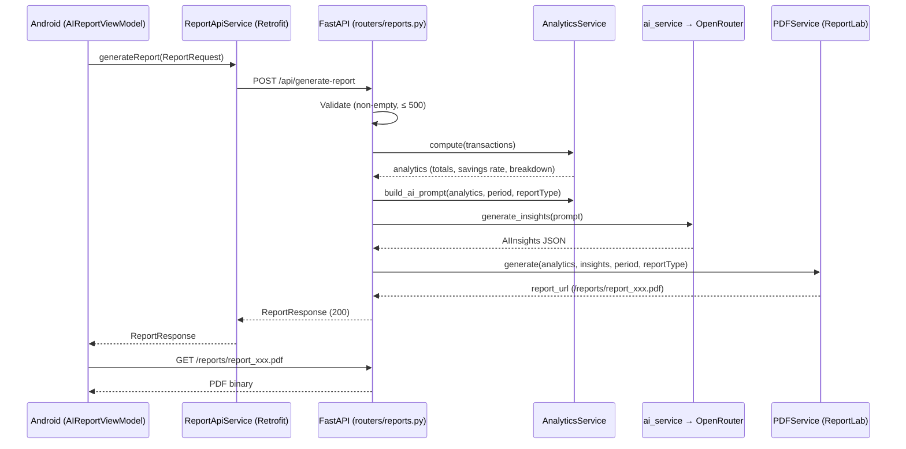

# API Reference

Base URL: `https://your-app.onrender.com` (production) or `http://10.0.2.2:8000` (Android emulator → host machine).

Interactive docs: `GET /docs` (Swagger UI) when running locally.

The backend is **stateless** — there is no authentication, no database, and no session. It receives transaction data, computes analytics, calls the AI, and returns a PDF path.

## Endpoints

| Method | Path | Description |
|--------|------|-------------|
| `POST` | `/api/generate-report` | Generate AI insights + branded PDF report |
| `GET` | `/api/health` | Health check (used by the Android app) |
| `GET` | `/reports/{filename}` | Download a generated PDF |
| `GET` | `/docs` | Swagger UI (dev only) |

---

## POST /api/generate-report

Generates financial analytics, AI insights, and a branded PDF.

### Request Body

```json
{
  "period": "2025-03-01 to 2025-03-31",
  "reportType": "monthly",
  "transactions": [
    {
      "id": "abc-123",
      "transactionType": "income",
      "amount": 50000,
      "memberName": "Alice Banda",
      "category": "Membership Fees",
      "paymentMethod": "Mobile Money",
      "isApproved": 1,
      "transactionDate": "2025-03-01",
      "notes": null,
      "createdAt": "2025-03-01T08:00:00",
      "updatedAt": "2025-03-01T08:00:00"
    }
  ]
}
```

| Field | Type | Constraints |
|-------|------|-------------|
| `period` | string | Human-readable period label shown on the report |
| `reportType` | string | e.g. `weekly`, `monthly`, `term` |
| `transactions` | array | 1–500 items (`MAX_TRANSACTIONS_PER_REQUEST`) |

> **`amount` is in ngwee** (integer). ZMW 500.00 = `50000`.

### Response `200 OK`

```json
{
  "success": true,
  "reportUrl": "/reports/report_abc123def4.pdf",
  "summary": "Monthly report for 2025-03-01 to 2025-03-31. Income: ZMW 500.00 ...",
  "insights": {
    "executiveSummary": "...",
    "insights": ["...", "..."],
    "recommendations": ["...", "..."],
    "concerns": "..."
  },
  "generatedAt": "2025-03-31T14:22:00+00:00"
}
```

### Error Responses

| Status | Condition |
|--------|-----------|
| `400` | `transactions` is empty, or exceeds 500 items |
| `502` | OpenRouter call failed (`RuntimeError` surfaced from `ai_service`) |
| `500` | Unexpected internal error (details logged server-side only) |

---

## GET /api/health

Simple liveness probe.

```json
{ "status": "ok", "service": "ICTAZ MU Financial Tracker Backend" }
```

---

## GET /reports/{filename}

Downloads a previously generated PDF as `application/pdf`.

**Security:** the filename is validated strictly — it must be a plain basename ending in `.pdf`, with no path separators or `..` components. After joining with the reports directory, the resolved real path is re-checked against the reports root (defence in depth against path traversal).

| Status | Condition |
|--------|-----------|
| `200` | PDF found and returned |
| `404` | Malformed filename, traversal attempt, or file not found |

---

## Report Generation Sequence



## Configuration

All settings come from `.env` (loaded via pydantic-settings in `config.py`):

| Variable | Default | Description |
|----------|---------|-------------|
| `OPENROUTER_API_KEY` | **required** | OpenRouter API key (`sk-or-v1-...`) |
| `AI_MODEL` | `qwen/qwen3-vl-30b-a3b-thinking` | OpenRouter model slug |
| `HTTP_REFERER` | *(empty)* | Sent to OpenRouter as `HTTP-Referer` for attribution; omitted when empty |
| `DEBUG` | `False` | Enables debug logging and uvicorn auto-reload |
| `HOST` / `PORT` | `0.0.0.0` / `8000` | Bind address for `python main.py` |
| `REPORTS_DIR` | `reports` | PDF output directory (created at startup) |
| `ALLOWED_ORIGINS` | `[]` | CORS origins — JSON array in `.env`, e.g. `["http://localhost:5173"]`. Empty means no cross-origin browser access |
| `MAX_TRANSACTIONS_PER_REQUEST` | `500` | Cap on transactions per report request |

### CORS behaviour

In `main.py`, if `ALLOWED_ORIGINS` contains `"*"`, credentials are disabled (a browser requirement — wildcard origins can't be combined with `allow_credentials=True`). Otherwise the listed origins get full credentialed access. Only `GET` and `POST` methods are allowed.

## Android Client Wiring

The base URL is injected as a `BuildConfig` field from `frontend/local.properties`:

```properties
BACKEND_BASE_URL=http://10.0.2.2:8000/    # emulator default if omitted
BACKEND_BASE_URL=https://your-app.onrender.com/  # production
```

It is consumed by `ReportApiService` via `BuildConfig.BACKEND_BASE_URL`. No Java changes are needed to repoint the backend.
