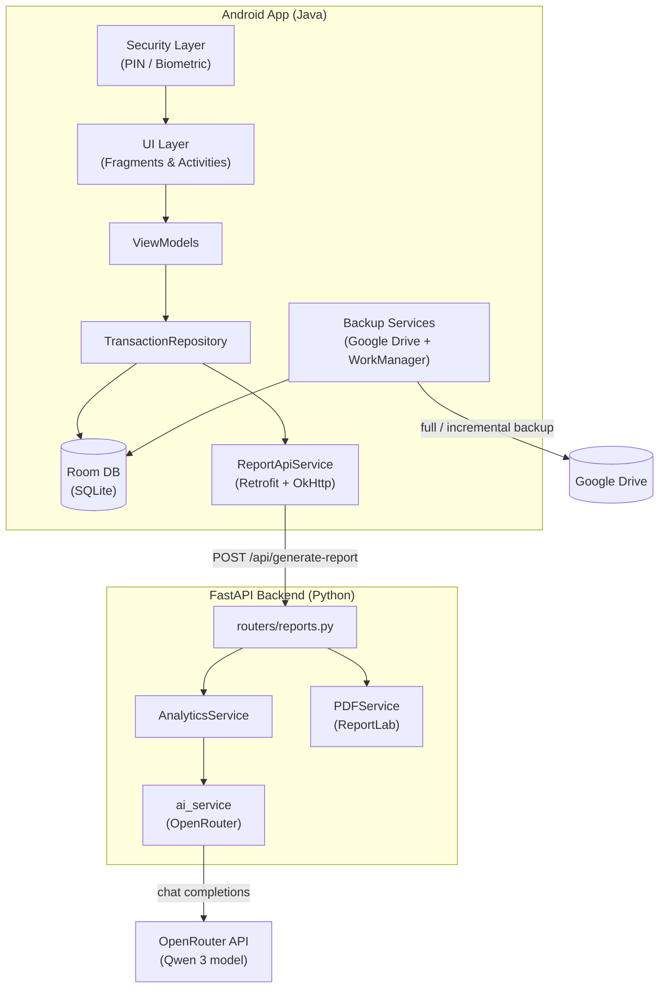
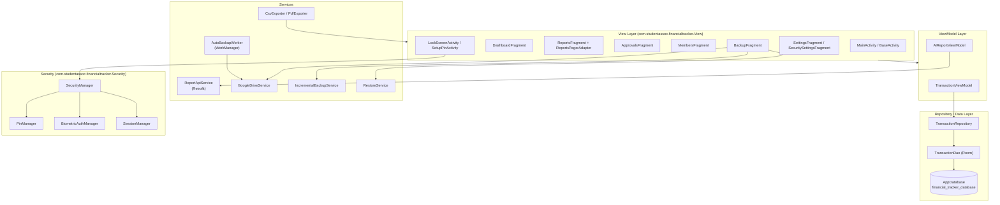
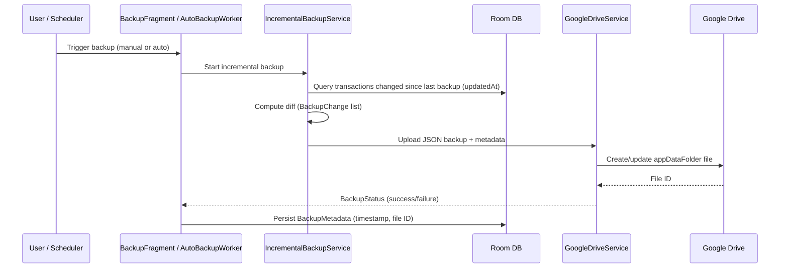
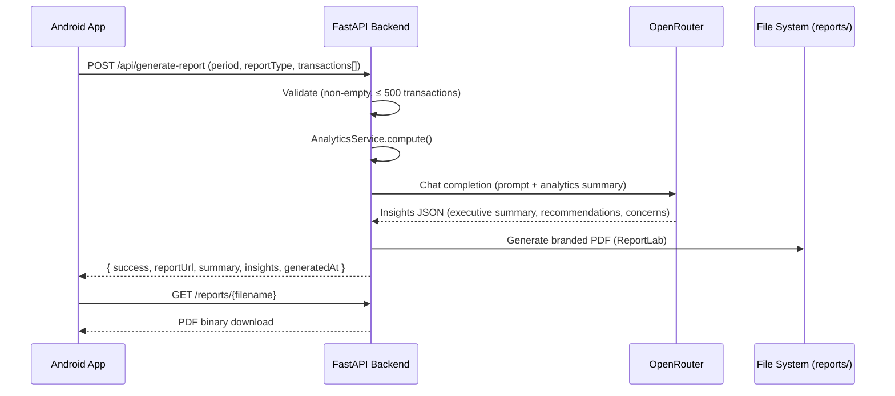

# Architecture

This document describes the high-level architecture of the ICTAZ MU Chapter Financial Tracker, the Android app's internal layering, and the backend request flow.

## System Overview

The system is **offline-first**: all transaction data lives on the device in a Room (SQLite) database. The backend is **stateless** — it has no database and no auth. It only exists to crunch analytics, call the AI model via OpenRouter, and generate branded PDF reports.

### Key Design Decisions

- **Offline-first** — All transactions are stored locally on the device. No server-side database exists.
- **Amounts in ngwee** — Monetary values are stored as integers (100 ngwee = 1 ZMW) to avoid floating-point issues. ZMW 500.00 = `50000`.
- **Backend is stateless** — It computes analytics, calls the AI, and generates PDFs. No auth, no persistence beyond generated PDF files.
- **Incremental backup** — Changed transactions are detected by `updatedAt` timestamps to minimize upload size.

---

## Android App Structure

The Android app follows an **MVVM (Model–View–ViewModel)** pattern with a repository layer.

### Package Layout

| Package | Responsibility |
|---------|----------------|
| `View` | Fragments, activities, RecyclerView adapters — all UI code |
| `ViewModel` | `TransactionViewModel` (Room data), `AIReportViewModel` (report API calls) |
| `Repository` | `TransactionRepository` (data access facade) and `AppDatabase` (Room singleton) |
| `DTO` | `TransactionDao` — Room DAO with all SQL queries |
| `Model` | Room entity (`Transaction`), summaries (`WeeklySummary`, `TermSummary`, `CategorySummary`), backup models, `FilterCriteria` |
| `services` | Google Drive backup/restore, incremental backup, Retrofit report API, exporters |
| `Backup` | `AutoBackupWorker` + `BackupScheduler` (WorkManager background backups) |
| `Security` | PIN storage, biometric auth, session timeout handling |
| `Utils` | CSV/PDF exporters, shared helpers |

### Navigation

The app uses Jetpack Navigation (`res/navigation/nav_graph.xml`) with a bottom navigation bar (Dashboard, Transactions, Reports, Settings). Lock flow: `MainActivity` → `LockScreenActivity` when the session times out or the app is locked.

---

## Backend Structure

The backend is a small FastAPI application with a clear pipeline per request.

```mermaid
flowchart LR
    REQ["POST /api/generate-report"] --> VAL["Validate<br/>(Pydantic + max 500 txns)"]
    VAL --> ANA["AnalyticsService.compute()"]
    ANA --> PROMPT["AnalyticsService.build_ai_prompt()"]
    PROMPT --> AI["generate_insights()<br/>→ OpenRouter"]
    AI --> PDFGEN["PDFService.generate()<br/>→ ReportLab PDF"]
    PDFGEN --> RESP["ReportResponse<br/>(reportUrl + insights)"]
    RESP --> DL["GET /reports/{filename}<br/>→ PDF download"]
```

### Module Responsibilities

| File | Responsibility |
|------|----------------|
| `main.py` | FastAPI app factory, lifespan (creates reports dir), CORS middleware |
| `config.py` | `Settings` (pydantic-settings) loaded from `.env` |
| `Model/transaction.py` | `Transaction` pydantic model — mirrors the Android `Transaction.java` entity |
| `Model/report.py` | `ReportRequest` / `ReportResponse` / `AIInsights` — mirrors the Android DTOs |
| `services/analytics.py` | Computes totals, savings rate, category breakdowns; builds the AI prompt |
| `services/ai_service.py` | OpenRouter chat-completions call (model from `AI_MODEL`) |
| `services/pdf_service.py` | Branded PDF generation with ReportLab |
| `routers/reports.py` | All API endpoints |

### Error Handling Contract

| Status | Meaning |
|--------|---------|
| `400` | Empty transaction list, or more than `MAX_TRANSACTIONS_PER_REQUEST` (500) |
| `502` | AI generation failed (`RuntimeError` from `ai_service`) |
| `500` | Unexpected internal error |
| `404` | Report file not found / path-traversal attempt on `GET /reports/{filename}` |

The `/reports/{filename}` endpoint validates the filename **before** joining paths and re-verifies the resolved path stays inside the reports directory (defence in depth against path traversal). Do not weaken this when touching the router.

---

## Backup & Sync Flow

Backups go to the user's own Google Drive via the Drive REST API. Incremental backups only upload transactions whose `updatedAt` changed since the last backup.

Restore runs the reverse flow: `RestoreService` downloads the JSON from Drive, parses it, and bulk-inserts via `TransactionDao.insertAll()`.

---

## AI Report Flow (End-to-End)

The Android side calls this through `AIReportViewModel` → `ReportApiService` (Retrofit), which reads `BuildConfig.BACKEND_BASE_URL`.
