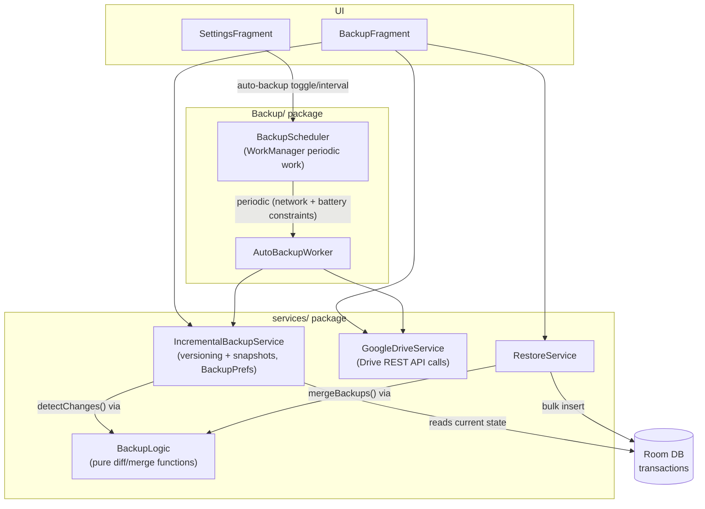
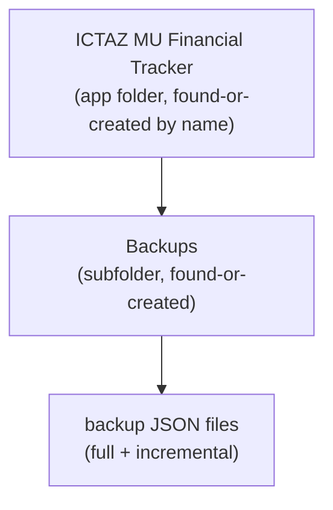
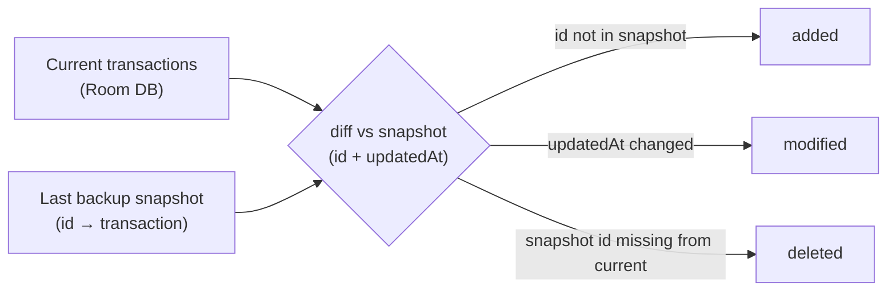
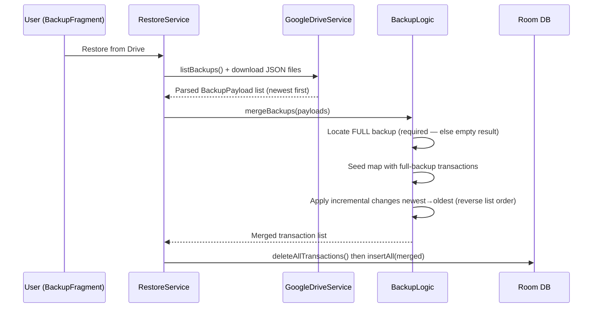

# Backup & Sync

The app backs up transaction data to the user's own **Google Drive**. There is no server-side sync — Drive is the only cross-device transport. This doc covers the architecture, the backup file format, incremental diffing, restore, and auto-backup scheduling.

## Component Overview



## Google Drive Layout

`GoogleDriveService` stores backups in a named folder in the user's Drive (not `appDataFolder` — the files live in a visible app folder):



- **Find-or-create**: the folder is located by a Drive query (`name = ... and mimeType = folder and trashed = false`) before any upload; if absent it is created.
- **Upload**: `uploadBackup(fileName, jsonContent, folderId)` writes a JSON file into the Backups folder.
- **List**: `listBackups(folderId)` returns all non-trashed files in the folder (newest first).
- **Retention**: `deleteOldBackups(folderId, keepCount)` prunes history down to the newest N backups.

## Backup Types

| Type | File contents | When |
|------|--------------|------|
| **FULL** | `metadata` + complete `transactions` list | First backup ever, manual "Full backup" action |
| **INCREMENTAL** | `metadata` + `changes` (added / modified / deleted, relative to the last snapshot) | Auto-backup and manual incremental backup afterwards |

### Backup File Format

`BackupLogic.BackupPayload` mirrors the JSON document stored in Drive:

```json
{
  "metadata": {
    "backupType": "full | incremental",
    "timestamp": "2026-09-05T10:00:00",
    "deviceId": "...",
    "version": 3,
    "baseVersion": 2,
    "lastBackupTimestamp": "2026-09-04T10:00:00",
    "transactionCount": 42,
    "fileSize": 12345
  },
  "transactions": [ { "...": "Transaction fields (full backups only)" } ],
  "changes": {
    "added":   [ { "...": "Transaction" } ],
    "modified":[ { "...": "Transaction" } ],
    "deleted": [ "transaction-id-1", "transaction-id-2" ]
  }
}
```

## Incremental Diff Logic

`IncrementalBackupService` keeps its state in `BackupPrefs` (SharedPreferences): last backup timestamp, backup version counter, device id, and a **transaction snapshot** (`id → transaction`) of the last successful backup.

`BackupLogic.detectChanges(currentTransactions, lastSnapshot)` is a pure function (unit-tested on the JVM in `BackupLogicTest`):



- **Added** — exists now, absent from snapshot
- **Modified** — exists in both but `updatedAt` differs
- **Deleted** — in snapshot but no longer in the current list

After a successful upload, `commitSnapshot(current, timestamp, version)` persists the new snapshot so the next diff starts from it.

## Restore / Merge Logic

`RestoreService` downloads the backup files from Drive and rebuilds local data via `BackupLogic.mergeBackups(backups)`:



Key rules:

- A restore **requires** a FULL backup to exist; incrementals alone merge to an empty list.
- Incremental change sets are applied in **reverse list order** (newest first) on top of the full backup.
- Restore replaces the local table (delete-all + bulk insert).

## Auto-Backup Scheduling

`BackupScheduler` manages a unique periodic WorkManager job:

| Property | Value |
|----------|-------|
| Worker | `AutoBackupWorker` |
| Work name / tag | `periodic_backup` / `auto_backup` |
| Policy | `ExistingPeriodicWorkPolicy.UPDATE` (re-scheduling with a new interval replaces the old job) |
| Interval | Configurable hours, set from Settings |
| Constraints | `NetworkType.CONNECTED` **and** battery-not-low |
| Enabled flag | `BackupPrefs.auto_backup_enabled` |

The worker runs the same incremental pipeline as the manual flow (diff → upload → commit snapshot).

## Multi-Device Notes

- Each device tracks its own snapshot and version counter (`deviceId` is stored in metadata), so incrementals are relative to *that device's* last backup.
- Restoring another device's backups works via the merge logic, but a device's local snapshot won't know about transactions it never snapshotted — a **full backup is the reliable cross-device transfer**, incrementals assume a continuous local history.

## Testing

`BackupLogic` is deliberately Android-free (pure JVM) so the diff/merge rules are covered by `frontend/app/src/test/java/.../BackupLogicTest.java`. If you change diff or merge behavior, extend those tests — don't move logic back into the Android service classes.
