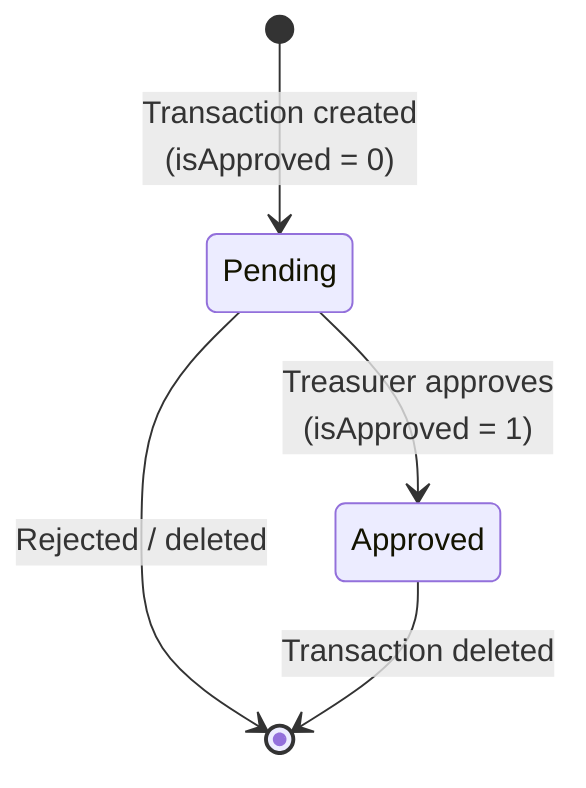

# Data Model

The app stores all data on-device in a Room (SQLite) database named `financial_tracker_database`. There is **no server-side database** — the backend receives transaction data as request payloads and holds nothing.

## Entity–Relationship Diagram (Chen Notation)

> **Notation key (Chen):**
> - **Rectangle** — entity
> - **Ellipse** — attribute (the **primary key** is bolded, i.e. underlined in classic Chen)
> - **Dashed ellipse/edge** — derived attribute (computed, never stored)
> - **Diamond** — relationship (used in the relationship diagram below)

The database currently contains a **single stored entity**: `TRANSACTIONS`. The other "models" in the Android code (`WeeklySummary`, `TermSummary`, `CategorySummary`) are query-result *projections* — they are derived from `TRANSACTIONS` at query time and are never persisted.

```mermaid
flowchart TB
    %% ─── Entity ──────────────────────────────────────────────
    T["TRANSACTIONS"]

    %% ─── Key attributes (underlined in Chen → bolded here) ───
    ID(["<b>id</b>"])

    %% ─── Simple attributes ───────────────────────────────────
    TTYPE(["transaction_type"])
    AMOUNT(["amount"])
    MEMBER(["member_name"])
    CATEGORY(["category"])
    PAYMENT(["payment_method"])
    APPROVED(["is_approved"])
    TDATE(["transaction_date"])
    NOTES(["notes"])
    CREATED(["created_at"])
    UPDATED(["updated_at"])

    %% ─── Derived attributes (dashed) ──────────────────────────
    TOTIN(["total_income"])
    TOTEX(["total_expenses"])
    BAL(["current_balance"])
    WK(["WeeklySummary"])
    TERM(["TermSummary"])
    CAT(["CategorySummary"])

    %% ─── Entity ↔ attribute edges ────────────────────────────
    T --- ID
    T --- TTYPE
    T --- AMOUNT
    T --- MEMBER
    T --- CATEGORY
    T --- PAYMENT
    T --- APPROVED
    T --- TDATE
    T --- NOTES
    T --- CREATED
    T --- UPDATED

    %% ─── Derived (dashed) edges ───────────────────────────────
    T -.- TOTIN
    T -.- TOTEX
    T -.- BAL
    T -.- WK
    T -.- TERM
    T -.- CAT
```

### Attribute Reference

| Attribute | Type | Constraints | Notes |
|-----------|------|-------------|-------|
| `id` | `String` | **Primary key**, non-null | UUID generated on-device |
| `transaction_type` | `String` | non-null | `'INCOME'` or `'EXPENSE'` (DAO queries match on these literals) |
| `amount` | `int` | — | **Ngwee**, not Kwacha. ZMW 500.00 = `50000` |
| `member_name` | `String` | nullable | Member who contributed/received funds |
| `category` | `String` | non-null | Free-text category, e.g. `"Membership Fees"` |
| `payment_method` | `String` | non-null | `"Cash"` or `"Mobile Money"` |
| `is_approved` | `int` | — | `0` = pending, `1` = approved (drives the Approvals workflow) |
| `transaction_date` | `String` | non-null | ISO `yyyy-MM-dd`; used for range queries and sorting |
| `notes` | `String` | nullable | Free-text notes |
| `created_at` | `String` | non-null | ISO timestamp |
| `updated_at` | `String` | non-null | ISO timestamp; **incremental backup** diffs on this field |

### Derived Attributes

These are computed by DAO aggregate queries and exposed as `LiveData` — they are **not** columns:

| Derived attribute | Backing query | Consumed by |
|-------------------|---------------|-------------|
| `total_income` | `SUM(amount) WHERE transaction_type='INCOME'` | Dashboard card |
| `total_expenses` | `SUM(amount) WHERE transaction_type='EXPENSE'` | Dashboard card |
| `current_balance` | Signed sum (income positive, expenses negative) | Dashboard card |
| `WeeklySummary` / `TermSummary` | Date-range aggregation POJOs | Reports tabs |
| `CategorySummary` | Per-category sums | Category breakdown list |

> **Important:** Dates are stored as ISO `String`s, not epoch longs. All range filtering in the DAO relies on lexicographic ISO ordering — keep the `yyyy-MM-dd` format.

## Approval Workflow

The approval status is a simple integer flag managed through the Approvals screen.

## DAO Query Surface

`TransactionDao` (in the `DTO` package) exposes:

| Query | Returns | Purpose |
|-------|---------|---------|
| `getAllTransactions()` | `LiveData<List<Transaction>>` | All transactions, newest date first |
| `getTotalIncome()` / `getTotalExpenses()` | `LiveData<Integer>` | SUM aggregates by type (dashboard cards) |
| `getCurrentBalance()` | `LiveData<Integer>` | Signed sum: income positive, expenses negative |
| `getTransactionsBetween(start, end)` | `LiveData<List<Transaction>>` | Date-range query (weekly/term summaries) |
| `getFilteredTransactionsWithMemberSearch(...)` | `LiveData<List<Transaction>>` | Multi-criteria filter: date range, category, payment method, approval status, member name LIKE |
| `getFilteredTransactionCount(...)` | `LiveData<Integer>` | Same filters, count only |
| `insert` / `insertAll` / `update` / `delete` / `deleteAllTransactions` | — | CRUD |

All read queries return `LiveData` so the ViewModels observe reactive updates.

## Database Migrations

`AppDatabase` is at **version 1** with `fallbackToDestructiveMigrationOnDowngrade()` enabled. This is marked as a dev-time convenience in the code — before any production release with schema changes, replace it with proper `Migration` objects so upgrades don't wipe user data.

## Backend Mirroring

The backend re-declares the same transaction shape as pydantic models so the JSON payloads line up:

| Android (Java) | Backend (Python) |
|----------------|------------------|
| `Model/Transaction.java` (Room entity) | `backend/Model/transaction.py` (pydantic) |
| `services/ReportRequest.java` / `ReportResponse.java` | `backend/Model/report.py` |
| `services/AIInsights.java` | `backend/Model/report.py` (`AIInsights`) |

If you add or rename a field on one side, **update both sides** — there is no schema sync between them. See [API Reference](./API.md) for the wire format.
