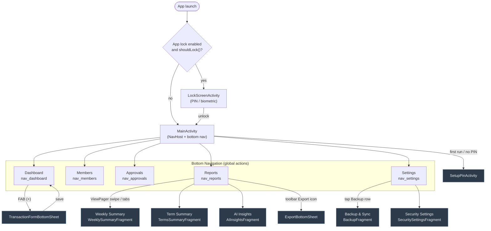

# Screens & Navigation

A tour of every screen in the app, how users reach it, and what it does. Source of truth for navigation is `frontend/app/src/main/res/navigation/nav_graph.xml`; the bottom nav menu is `res/menu/bottom_nav_menu.xml`.

## Navigation Map

The app uses Jetpack Navigation with a single `MainActivity` hosting a NavHost fragment. Five destinations sit in the **bottom navigation** (wired as *global actions*, reachable from anywhere with `launchSingleTop`); Backup, AI Insights, and Export are **secondary destinations** reached from their parents.

### Navigation Details

| Action | Source | Destination | Notes |
|--------|--------|-------------|-------|
| `action_global_*` | Bottom nav items | Dashboard / Members / Approvals / Reports / Settings | All `launchSingleTop`; `popUpTo` Dashboard (not inclusive) so the back stack stays shallow |
| `action_settings_to_backup` | Settings row tap | Backup & Sync | Child of Settings — not in bottom nav |
| Reports tabs | `ReportsPagerAdapter` | Weekly / Term / AI Insights | ViewPager2 swipe — **not** nav graph destinations |
| Export | Reports toolbar menu (`menu_toolbar_reports.xml`) | `ExportBottomSheet` | Modal bottom sheet |
| Lock flow | `BaseActivity.onResume()` | `LockScreenActivity` | Clears the task (`FLAG_ACTIVITY_CLEAR_TASK`) — see [Security](./SECURITY.md) |

---

## Screen Reference

### Dashboard (`DashboardFragment`)
**Home screen.** Summary stat cards for **total income**, **total expenses**, and **current balance** (all derived via `LiveData` from the DAO aggregates), plus a category breakdown list (`CategoryBreakdownAdapter`) and a recent-transactions list with income/expense color coding.

- **FAB (+)** opens `TransactionFormBottomSheet` to add a transaction
- Toolbar filter icon opens `FilterDialogFragment` (multi-criteria: date range, category, payment method, approval status, member search — with active-filter chips)

### Transaction Form (`TransactionFormBottomSheet`)
Modal bottom sheet for adding/editing a transaction: type toggle (INCOME/EXPENSE), amount (entered in Kwacha, stored in **ngwee**), member name, category, payment method (Cash / Mobile Money), date, notes, and approval status. Saves through `TransactionViewModel` → `TransactionRepository`.

### Members (`MembersFragment`)
Income grouped by member with a search field (`MembersAdapter`). Read-only view for "who has contributed what".

### Approvals (`ApprovalsFragment`)
Lists pending transactions (`isApproved = 0`) with **approve / reject** actions (`ApprovalsAdapter`). Approving flips `isApproved` to 1 — see the approval state diagram in [Data Model](./DATA_MODEL.md).

### Reports (`ReportsFragment` + `ReportsPagerAdapter`)
Hosts three tabs via ViewPager2:

| Tab | Fragment | Content |
|-----|----------|---------|
| Weekly Summary | `WeeklySummaryFragment` | Date-bucketed income/expense summary for recent weeks |
| Term Summary | `TermsSummaryFragment` | Term-bucketed summary (academic terms) |
| AI Insights | `AIInsightsFragment` | Generates a report via the backend: picks period + type, calls `AIReportViewModel` → `/api/generate-report`, shows executive summary, insights, recommendations, concerns, and offers the branded PDF download |

Toolbar export icon opens the **Export bottom sheet**.

### Export (`ExportBottomSheet` / `ExportFragment`)
Two export paths:

- **CSV** — via `CsvExporter`, with optional summary header
- **PDF** — two flavors: local styled table PDF via `PdfExporter`, or the branded AI report PDF downloaded from the backend

### Settings (`SettingsFragment`)
Entry point for app preferences:

- **Backup & Sync** row → `BackupFragment` (see [Backup & Sync](./BACKUP.md))
- **Security** row → `SecuritySettingsFragment` (app lock, PIN, biometrics, auto-lock timeout — see [Security](./SECURITY.md))
- Auto-backup scheduling controls (delegates to `BackupScheduler`)
- Dark theme toggle

### Backup & Sync (`BackupFragment`)
Google Drive backup UI: manual **full backup**, **incremental backup**, restore from backup, backup list with delete, and auto-backup toggle/interval. See [Backup & Sync](./BACKUP.md) for the internals.

### Lock Screen (`LockScreenActivity`) & PIN Setup (`SetupPinActivity`)
Full-screen activities outside the nav graph. `LockScreenActivity` verifies the PIN (with attempt lockout) or offers biometric auth; `SetupPinActivity` runs first-run PIN creation. Gated by `BaseActivity` — see [Security](./SECURITY.md).

---

## UI Conventions

- **Theme**: custom dark/light themes (`values/themes.xml`, `values-night/themes.xml`) with the Plus Jakarta Sans font family
- **Adapters**: one RecyclerView adapter per list type, all in `View/` (`TransactionAdapter`, `ApprovalsAdapter`, `MembersAdapter`, `CategoryBreakdownAdapter`)
- **Data flow**: fragments observe `ViewModel` `LiveData`; fragments never touch the DAO directly
- **Lock check**: every activity extends `BaseActivity`, which routes to the lock screen when the session times out (configurable Immediately → Never)
