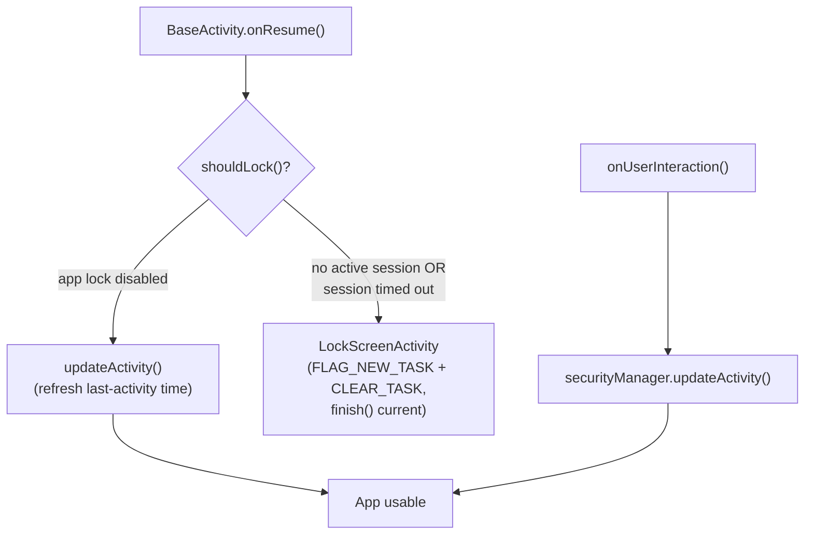
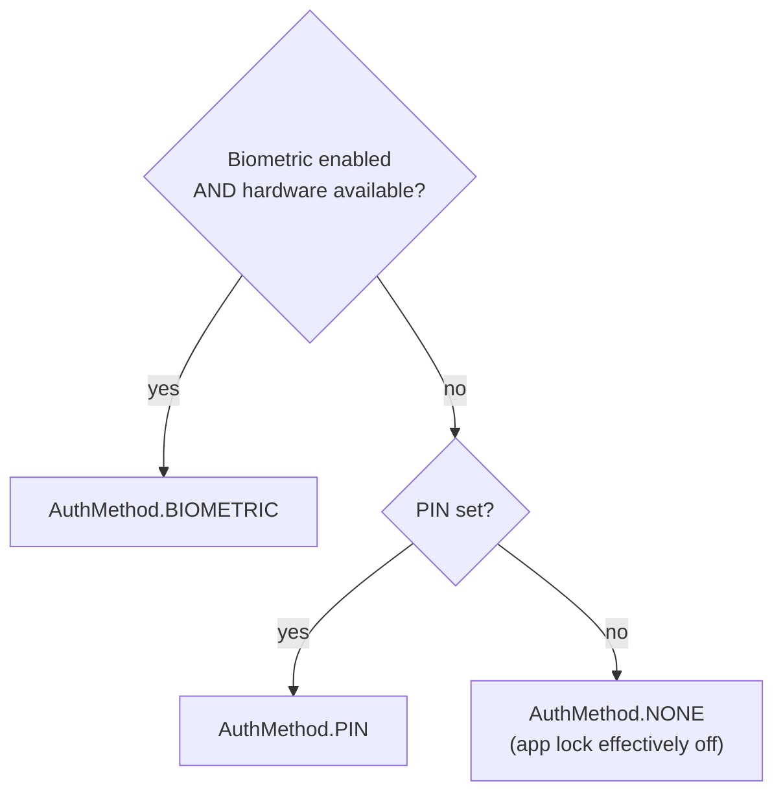
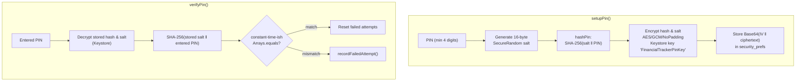
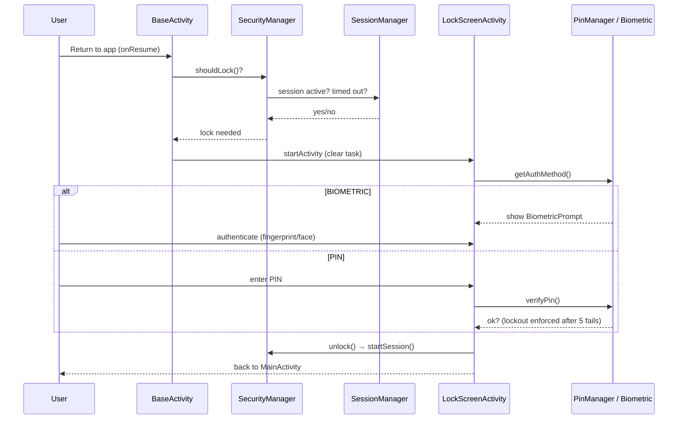

# Security

How the app protects the treasurer's financial data on-device: app lock (PIN + biometric), session timeout, and what is (and isn't) protected elsewhere in the stack.

All security code lives in `frontend/app/src/main/java/com/studentassoc/financialtracker/Security/`.

## Components

| Class | Responsibility | Persistence |
|-------|----------------|-------------|
| `SecurityManager` | Facade/singleton — decides *whether* to lock and *which* auth method to use | `security_settings` prefs (`app_lock_enabled`, `biometric_enabled`) |
| `PinManager` | PIN setup/verify/change, hashing, keystore encryption, failed-attempt lockout | `security_prefs` + **Android Keystore** |
| `SessionManager` | Session activity tracking and auto-lock timeout | `session_prefs` |
| `BiometricAuthManager` | Wraps `BiometricPrompt`, checks hardware/credential availability | — |

## App Lock Flow

Every activity extends `BaseActivity`, which enforces the lock on every resume and on every user interaction:



`shouldLock()` logic:

```java
if (!isAppLockEnabled()) return false;
return !sessionManager.isSessionActive() || sessionManager.hasSessionTimedOut();
```

## Authentication Method Selection

`SecurityManager.getAuthMethod()` resolves the unlock method:



- Biometric only appears as an option when the user enabled it **and** `BiometricAuthManager.isBiometricAvailable()` passes (enrolled biometric or device credential).
- PIN is the always-available fallback.

## PIN Storage & Verification

PINs are **never stored in plaintext**. `PinManager` combines a salted SHA-256 hash with AES-GCM encryption bound to a hardware-backed Keystore key:



Key parameters:

| Parameter | Value |
|-----------|-------|
| Keystore alias | `FinancialTrackerPinKey` (AES-256, GCM, in **AndroidKeyStore**) |
| Cipher | `AES/GCM/NoPadding`, 12-byte IV prepended to ciphertext, 128-bit GCM tag |
| Hash | SHA-256 with 16-byte random salt |
| PIN length | 4–6 digits (`MIN_PIN_LENGTH = 4`) |

### Brute-Force Lockout

| Rule | Value |
|------|-------|
| Max failed attempts | `MAX_FAILED_ATTEMPTS = 5` |
| Lockout duration | 5 minutes (`LOCKOUT_DURATION_MS`) |
| Behavior | After the 5th failure, `LOCKOUT_TIME` is set; `verifyPin()` refuses (returns `false`) until it expires. The countdown is surfaced via `getRemainingLockoutMs()` |
| Reset | Successful verification clears attempts **and** lockout |

The lockout deadline is stored, not computed — so it survives process death.

## Session Timeout

`SessionManager` tracks the session in `session_prefs`:

- `startSession()` on successful unlock (marks active, stamps last activity)
- `updateActivity()` on every user interaction (via `BaseActivity.onUserInteraction()`)
- `hasSessionTimedOut()` compares elapsed time against the configured timeout; `Long.MAX_VALUE` means "Never"

Configurable options (Settings → Security):

| Option | Duration |
|--------|----------|
| Immediately | 0 ms |
| 30 seconds | 30 s |
| 1 minute | 60 s |
| 5 minutes *(default)* | 5 min |
| 10 minutes | 10 min |
| 30 minutes | 30 min |
| Never | `Long.MAX_VALUE` |

## Unlock Sequence (End to End)



## What Is *Not* Protected (Known Gaps)

Be aware of these when touching related code — they are deliberate trade-offs of an educational/offline-first project, not invitations to rely on them:

1. **Transaction database is not encrypted at rest.** Room stores `financial_tracker_database` unencrypted; the app lock is a UI-level gate, not disk encryption. (SQLCipher/`SupportFactory` would be the upgrade path.)
2. **PIN hash uses a single SHA-256 round.** Salted, but not a memory-hard KDF (PBKDF2/scrypt/Argon2 would be stronger). The Keystore encryption of the hash compensates somewhat by requiring the hardware key to even read it.
3. **Backup files in Drive are plaintext JSON.** Any full transaction history is readable by anything with access to that Drive folder.
4. **Security prefs are `SharedPreferences`, not `EncryptedSharedPreferences`.** The PIN hash/salt *values* are themselves AES-GCM encrypted via Keystore, but the flags (`pin_enabled`, `app_lock_enabled`, session timestamps) are plaintext.
5. **Backend has no auth.** Anyone who knows the URL can POST transactions to `/api/generate-report`. Acceptable because the backend holds no data — see [API Reference](./API.md).

## Testing

`UtilsTest`, `BackupLogicTest` cover non-Android logic. PIN/Keystore/session behavior requires a device or emulator (Keystore is hardware/virtual-hardware backed) — verify manually via Settings → Security when changing `Security/` classes.
